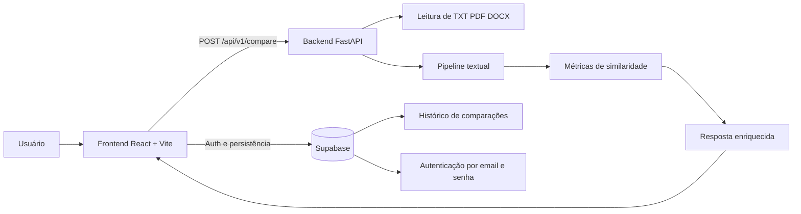

# Arquitetura Técnica

## Visão geral

O projeto `Análise Textual TCC` está organizado em três camadas principais:

- `frontend`: interface React para upload, navegação, autenticação e visualização dos resultados
- `backend`: API FastAPI responsável pela leitura, processamento e comparação dos documentos
- `supabase`: camada opcional de autenticação e persistência do histórico

## Diagrama da arquitetura

## Fluxo principal da comparação

1. O usuário envia dois arquivos pelo frontend.
2. O frontend aciona `POST /api/v1/compare`.
3. O backend valida formato, tamanho e conteúdo dos arquivos.
4. O serviço de leitura extrai texto de `.txt`, `.pdf` ou `.docx`.
5. O pipeline textual normaliza o conteúdo, tokeniza o texto e separa sentenças e parágrafos.
6. O serviço de comparação calcula as métricas e monta o resultado consolidado.
7. O frontend apresenta o relatório e, se houver sessão ativa, também salva o histórico no Supabase.

## Backend

### Responsabilidades

- validar uploads e extensões permitidas
- extrair texto de múltiplos formatos
- preprocessar conteúdo textual
- calcular métricas de similaridade
- gerar relatórios em `JSON`, `TXT` e `PDF`

### Módulos principais

- `app/api/routes/health.py`: endpoint de status da API
- `app/api/routes/comparison.py`: endpoints de comparação e exportação
- `app/core/config.py`: configuração central da aplicação
- `app/services/document_reader.py`: leitura e validação de arquivos
- `app/services/text_pipeline.py`: normalização, tokenização e matching textual
- `app/services/comparison_service.py`: composição do resultado final
- `app/services/report_service.py`: geração de relatórios exportáveis

## Frontend

### Responsabilidades

- exibir estado do backend
- enviar arquivos para análise
- mostrar métricas, trechos e destaques
- exportar resultados localmente
- autenticar usuários
- gerenciar histórico local e persistente

### Organização

O frontend foi dividido em:

- `features/`: fluxos de tela e painéis principais
- `components/`: elementos reutilizáveis de interface
- `lib/`: utilitários, integração com API e persistência local

## Supabase

### Uso no projeto

- `Auth`: cadastro e login por email e senha
- `Postgres`: persistência das comparações
- `RLS`: isolamento de acesso por usuário

### Dados persistidos

A tabela `comparison_runs` armazena:

- título, data e classificação da análise
- índice de correlação
- resumo textual
- métricas em `jsonb`
- trechos e parágrafos relacionados
- estatísticas dos documentos analisados

## Estratégia de testes

### Backend

- teste de saúde da API
- teste de comparação com resposta enriquecida
- teste de matching por parágrafos
- teste de rejeição de extensão inválida
- teste de exportação em `TXT`
- teste de exportação em `PDF`

### Frontend

- renderização da aplicação
- validações básicas de envio

## Evolução recomendada

- adicionar lint e formatação automática no frontend e no backend
- extrair partes do `App.jsx` para hooks ou módulos de estado
- remover artefatos gerados do repositório, como `node_modules`, `dist` e ambientes virtuais
- expandir testes de interface e cenários de erro
